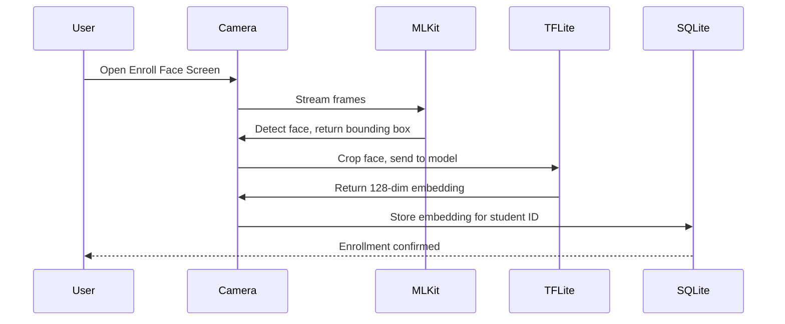
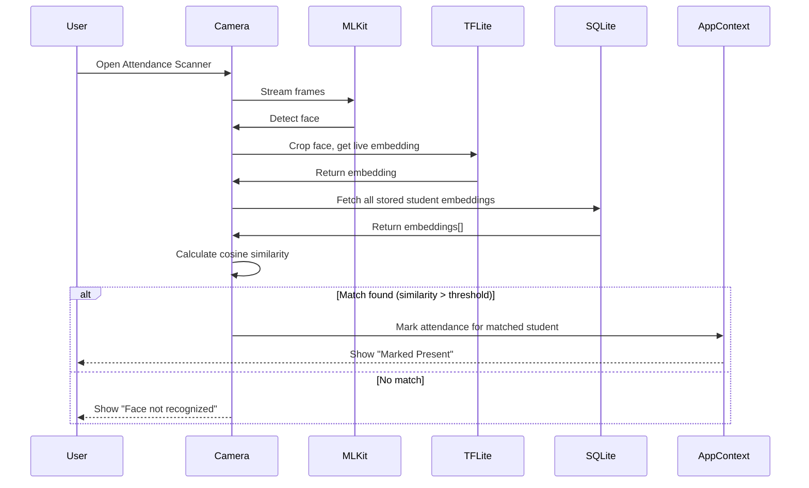

# Face Recognition Implementation Status

> [!CAUTION]
> **Current State: SIMULATED** — The face recognition is currently a placeholder. The scanner randomly picks an enrolled student instead of actually detecting faces.

## Implementation Checklist

| Task | Status | File(s) |
|---|---|---|
| SQLite database schema | ✅ Done | `lib/database.ts` |
| Face embeddings CRUD | ✅ Done | `lib/database.ts` |
| Replace expo-camera with vision-camera | ✅ Done | `EnrollFaceScreen.tsx`, `AttendanceScannerScreen.tsx` |
| ML Kit face detection integration | ✅ Done | Both screens |
| TFLite model loading | ✅ Done | `lib/faceRecognition.ts` |
| Image pixel decoding (Skia) | ✅ Done | `lib/faceRecognition.ts` |
| Real embedding generation | ✅ Done | `generateEmbeddingFromPhoto()` |
| Cosine similarity matching | ✅ Done | `lib/faceRecognition.ts` |
| Connect real detection to UI | ✅ Done | Both scanner screens |
| MobileFaceNet `.tflite` model | ✅ Done | `assets/models/mobilefacenet.tflite` |

---

## MobileFaceNet Model Download

You need a `.tflite` model file to generate face embeddings. 

### Recommended Model

**MobileFaceNet 128-dim** (~5 MB) — Good balance of accuracy and speed.

### Download Sources

| Source | Link | Notes |
|---|---|---|
| Hugging Face | [insightface/MobileFaceNet](https://huggingface.co/public-data/insightface/tree/main/models) | Official weights |
| GitHub | [niceDev0908/face-recognition](https://github.com/niceDev0908/face-recognition) | Pre-converted TFLite |
| TensorFlow Hub | Search "MobileFaceNet" | May need conversion |

### Installation

1. Download `mobilefacenet.tflite` (or similar)
2. Place in `assets/models/mobilefacenet.tflite`
3. Add to `app.json` assets if needed:
   ```json
   "expo": {
     "assetBundlePatterns": ["assets/models/*"]
   }
   ```

---

## Download Size Summary

| Component | Size | Notes |
|---|---|---|
| MobileFaceNet TFLite | ~5 MB | Bundled in app |
| react-native-vision-camera | ~2 MB npm | +10 MB to APK |
| react-native-fast-tflite | ~1 MB npm | +10 MB to APK |
| ML Kit Face Detection | ~1 MB npm | +25 MB to APK |
| **Total APK increase** | **~50-60 MB** | From ~40 MB to ~100 MB |

---

# Storage Clarification

## Current Approach: AsyncStorage
The app currently uses `@react-native-async-storage/async-storage` to persist student and session data. AsyncStorage is a key-value store, suitable for small amounts of data but less performant and harder to query for relational data.

## Proposed Approach: expo-sqlite

`expo-sqlite` provides a full SQLite database on the user's device, offering:
- **Relational data storage**: Better for linked entities like students and attendance records.
- **Complex queries**: SQL allows for efficient filtering, sorting, and aggregation.
- **Automatic persistence**: The database file is stored in `FileSystem.documentDirectory` and persists across app restarts.

## Development Considerations

| Environment | Behavior |
|---|---|
| **iOS Simulator / Android Emulator** | SQLite works identically to a physical device. Data persists on the simulator/emulator's file system. |
| **Expo Go** | `expo-sqlite` works in Expo Go. Data is stored within the Expo Go app's sandboxed file system. **Note:** Data may be lost if the user clears Expo Go's data or reinstalls the app. |
| **Development Build** | A custom development build (`npx expo run:android` or `npx expo run:ios`) provides the most stable environment for testing persistent storage. |
| **Web** | `expo-sqlite` does **not** support web. For web, a fallback (like AsyncStorage or a web-specific solution like IndexedDB) would be needed if web support is a requirement. |

## Migration Strategy
Since the current data format is JSON stored in AsyncStorage, the initial SQLite setup will create empty tables. Existing data in AsyncStorage will not be automatically migrated. If needed, a one-time migration script could be added.

---

# Facial Recognition Approach (Android Only)

## Overview

The goal is to implement on-device facial **verification** (1:N matching) to mark student attendance. This involves:
1.  **Face Detection**: Locating a face in the camera frame.
2.  **Face Embedding (Feature Extraction)**: Converting the detected face image into a numerical vector (embedding).
3.  **Verification**: Comparing the live embedding against stored embeddings to find a match.

## Recommended Technology Stack

| Component | Library | Purpose |
|---|---|---|
| **Camera & Frame Processing** | `react-native-vision-camera` | High-performance camera with frame processor support. Recommended by Expo for face-related tasks. |
| **Face Detection** | `@infinitered/react-native-mlkit-face-detection` | Detects faces and returns bounding boxes/landmarks using Google ML Kit. |
| **Face Embedding Model** | MobileFaceNet (`.tflite`) | A lightweight, efficient model for generating 128/192/512-dimensional face embeddings. |
| **TFLite Inference** | `react-native-fast-tflite` | Runs `.tflite` models with GPU acceleration and JSI for optimal performance. |

## Face Enrollment Flow



1.  The user selects a student and opens the "Enroll Face" screen.
2.  The camera streams frames to ML Kit for face detection.
3.  When a face is detected and stable, the face region is cropped.
4.  The cropped face is passed to the MobileFaceNet TFLite model.
5.  The model outputs a 128-dimensional embedding (array of floats).
6.  This embedding is stored in SQLite, linked to the student's ID.

## Face Verification Flow (Attendance)



1.  The camera detects a face and generates a live embedding.
2.  The app fetches all enrolled student embeddings from SQLite.
3.  Cosine similarity (or Euclidean distance) is calculated between the live embedding and each stored embedding.
4.  If a similarity score exceeds a threshold (e.g., 0.6), the student is identified.
5.  Attendance is marked for that student.

---

# Storage Schema for Face Embeddings

A new `face_embeddings` table will store the face data.

```sql
CREATE TABLE IF NOT EXISTS face_embeddings (
  id INTEGER PRIMARY KEY AUTOINCREMENT,
  studentId TEXT NOT NULL UNIQUE,
  embedding TEXT NOT NULL, -- JSON-serialized array of floats
  createdAt TEXT NOT NULL,
  FOREIGN KEY (studentId) REFERENCES students(id) ON DELETE CASCADE
);
```

**Relationship to Student**: One-to-one. Each student has one face embedding (or we could support multiple for robustness).

**Why TEXT for embedding?**: SQLite doesn't have a native BLOB-friendly way to handle typed arrays in JS. Storing as JSON `[0.1, 0.2, ...]` is simple and performant enough for ~1000 students with 128-dim embeddings.

---

# Exporting Attendance Data

## Approach
The app will support exporting attendance session data to a **CSV file**, which can be shared via the device's native share sheet (email, Drive, etc.).

## Implementation

| Component | Library | Purpose |
|---|---|---|
| **File Generation** | `expo-file-system` | Write CSV content to a temporary file. |
| **Sharing** | `expo-sharing` | Open native share sheet to export the file. |

## Export Format (CSV)

```csv
Session Date,Session Time,Student ID,Student Name,Marked At
"Sat, Dec 7, 2024","10:30 AM","STU001","John Doe","10:32 AM"
"Sat, Dec 7, 2024","10:30 AM","STU002","Jane Smith","10:35 AM"
```

The user will be able to export:
- A **single session** from the Session Detail screen.
- **All sessions** (or a date range) from the Reports screen.

---

# Summary of Required Dependencies

| Package | Purpose | Installation |
|---|---|---|
| `expo-sqlite` | ✅ Installed | Local SQLite database |
| `react-native-vision-camera` | Camera & frame processing | `npx expo install react-native-vision-camera` |
| `@infinitered/react-native-mlkit-face-detection` | Face detection | `npm install @infinitered/react-native-mlkit-face-detection` |
| `react-native-fast-tflite` | TFLite inference | `npm install react-native-fast-tflite` |
| `expo-file-system` | ✅ Already in Expo | File I/O for export |
| `expo-sharing` | Export via share sheet | `npx expo install expo-sharing` |

> [!IMPORTANT]
> Facial recognition with TFLite requires a **development build** (`npx expo prebuild`, then `npx expo run:android`). It **will not work in Expo Go**.

---

# Switching to Development Builds

## Why Development Builds?

Expo Go is a pre-built app that includes a curated set of native modules. When you need native libraries not included in Expo Go (like `react-native-vision-camera`, `react-native-fast-tflite`, or ML Kit), you must create a **development build**—a custom version of the app with your specific native dependencies.

## Prerequisites

1.  **Android Studio** installed with:
    - Android SDK
    - Android SDK Platform-Tools
    - An Android Emulator or physical device with USB debugging enabled
2.  **Java Development Kit (JDK)** version 17 or newer
3.  Set environment variables:
    - `ANDROID_HOME` pointing to your Android SDK location
    - Add `platform-tools` to your `PATH`

## Android Studio Setup (Windows)

### 1. Open SDK Manager

In Android Studio:
1. Go to **File → Settings** (or **Android Studio → Preferences** on Mac)
2. Navigate to **Languages & Frameworks → Android SDK**
3. Or use the quick access: **More Actions → SDK Manager** from the welcome screen

### 2. Install Required SDK Components

In the **SDK Platforms** tab, ensure you have:
- [x] Android 14.0 (API 34) or the latest stable version

In the **SDK Tools** tab, ensure these are installed:
- [x] Android SDK Build-Tools (latest version)
- [x] Android SDK Command-line Tools
- [x] Android SDK Platform-Tools
- [x] Android Emulator
- [x] NDK (Side by side) - **required for native builds**
- [x] CMake - **required for native builds**

Click **Apply** to download and install.

### 3. Find Your SDK Path

The SDK path is shown at the top of the SDK Manager window. On Windows, it's typically:
```
C:\Users\<YourUsername>\AppData\Local\Android\Sdk
```

### 4. Set Environment Variables (Windows)

Open **System Properties → Environment Variables** (search "environment variables" in Start menu):

**User Variables:**
| Variable | Value |
|---|---|
| `ANDROID_HOME` | `C:\Users\<YourUsername>\AppData\Local\Android\Sdk` |

**Edit PATH** (add these):
```
%ANDROID_HOME%\platform-tools
%ANDROID_HOME%\emulator
%ANDROID_HOME%\tools
%ANDROID_HOME%\tools\bin
```

### 5. Verify Setup

Open a **new** terminal (close and reopen if already open) and run:

```bash
adb --version
# Should show: Android Debug Bridge version X.X.X

emulator -version
# Should show: Android emulator version X.X.X
```

### 6. Create or Start an Emulator

#### Option A: Via Android Studio (GUI)

1. Open Android Studio
2. Go to **More Actions → Virtual Device Manager** (or **Tools → Device Manager** if a project is open)
3. If no emulator exists, click **Create Device**:
   - Choose a device (e.g., **Pixel 7**)
   - Click **Next**
   - Select a system image (e.g., **API 34** with **Google Play** - download if needed)
   - Click **Next → Finish**
4. Click the **Play ▶** button next to your emulator to start it

#### Option B: Via Command Line

List available emulators:
```bash
emulator -list-avds
```

Start an emulator by name:
```bash
emulator -avd <emulator_name>
# Example: emulator -avd Pixel_7_API_34
```

Start in background (headless for CI/scripts):
```bash
emulator -avd <emulator_name> -no-window -no-audio &
```

#### Verify Device is Connected

Once the emulator is running (or physical device connected), verify with:
```bash
adb devices
```

You should see output like:
```
List of devices attached
emulator-5554   device
```

> [!TIP]
> **Physical Device**: Enable **USB Debugging** in **Settings → Developer Options** and connect via USB. Accept the debugging prompt on the device.

## Step-by-Step Setup

### 1. Install expo-dev-client

This package provides the development client UI (similar to Expo Go but for your custom build):

```bash
npx expo install expo-dev-client
```

### 2. Generate Native Projects (Prebuild)

This creates the `android/` folder with native Android project files:

```bash
npx expo prebuild --platform android
```

> [!NOTE]
> This command generates native code based on your `app.json` and installed packages. Run it again if you add new native dependencies.

### 3. Build and Run

Connect your Android device or start an emulator, then run:

```bash
npx expo run:android
```

This compiles the native code and installs the app on your device/emulator. The first build takes several minutes.

### 4. Start Development Server

After the initial build, you can start the JS bundler with:

```bash
npm run dev
# or
npx expo start --dev-client
```

The app will connect to your dev server just like Expo Go, but with all your custom native modules available.

## Workflow Comparison

| Action | Expo Go | Development Build |
|---|---|---|
| **Initial Setup** | None | `npx expo prebuild` + first build |
| **Start Dev Server** | `npm run dev` | `npm run dev` (after initial build) |
| **Add JS-only Package** | Instant reload | Instant reload |
| **Add Native Package** | Not supported | Requires rebuild (`npx expo run:android`) |
| **Debugging** | Supported | Supported |# From your project folder
npx expo start
| **Custom Native Code** | Not supported | Fully supported |

## Troubleshooting

| Issue | Solution |
|---|---|
| `SDK location not found` | Set `ANDROID_HOME` environment variable |
| `adb: command not found` | Add `platform-tools` to your `PATH` |
| Build fails after adding package | Delete `android/` folder and run `npx expo prebuild` again |
| App crashes on launch | Check `npx expo run:android` logs for native errors |

## Recommended Approach for This Project

1.  **Install all native dependencies first** (vision-camera, mlkit, tflite, etc.)
2.  Run `npx expo prebuild --platform android`
3.  Run `npx expo run:android` to build and test
4.  Use `npm run dev` for subsequent JS changes

